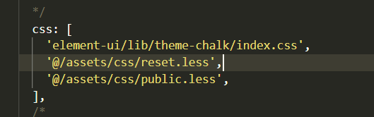

# 项目记录

## 1.项目构建
 1.1  使用`npx create-nuxt-app myBlog`创建项目模板  
 1.2  `npm run dev` 运行项目

## 2.项目配置

2.1 配置全局`css`
- 配置reset.css 及 pulic.less

- 注册全局过滤器  
1. 在plugin文件夹下新建filters.js，将文件中过滤器注册为全局过滤器
2. 在nuxt.config.js文件plugin添加filters.js

## 数据库设计
 1. 文章列表 articleList
  字段 | 类型 | 说明
   - | - | -
  title | String |  标题
  des | String |描述
  views | String |查看
  likes | Number |点赞
  createTime | Date |发表时间
  img | String | 缩略图 

 2. 详情表 articleDetail
  字段 | 类型 | 说明
   - | - | -
  title | String |  标题
  content | String |描述
  views | String |查看
  likes | Number |点赞
  createTime | Date |发表时间
  tag | String | 标签

​    